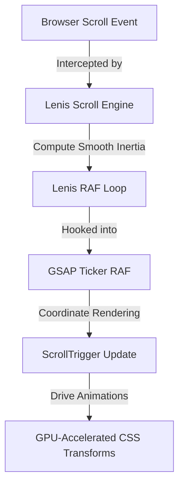

# Syncwave Media — Motion & Interaction Specification

This document defines the high-end scrollytelling choreography, scroll-driven physics, dynamic canvas mathematics, and custom interaction architectures for the Syncwave Media web experience. All animations are engineered for **60FPS+ smooth rendering** on mobile and desktop devices.

---

## 1. Smooth Scroll Integration (Lenis + GSAP Timeline Sync)

To establish a unified timeline where scroll triggers execute synchronously with browser refreshes, we bind **Lenis Smooth Scroll** to the **GSAP Ticker**. This bypasses default browser mechanical scrolling and prevents scroll-lag/jitter.

### Synchronization Architecture



### Implementation Code (`src/components/SmoothScroll.jsx`)

```javascript
import { useEffect } from 'react';
import Lenis from 'lenis';
import { gsap } from 'gsap';
import { ScrollTrigger } from 'gsap/ScrollTrigger';

gsap.registerPlugin(ScrollTrigger);

const SmoothScroll = () => {
  useEffect(() => {
    // 1. Initialize Lenis with custom damping coefficients
    const lenis = new Lenis({
      duration: 1.2,
      easing: (t) => Math.min(1, 1.001 - Math.pow(2, -10 * t)), // Custom premium easeOutExponential
      orientation: 'vertical',
      gestureOrientation: 'vertical',
      smoothWheel: true,
      wheelMultiplier: 1.0,
      infinite: false,
    });

    // 2. Synchronize ScrollTrigger with Lenis updates
    lenis.on('scroll', ScrollTrigger.update);

    // 3. Bind Lenis animation frame updates to the GSAP Ticker
    const updateRaf = (time) => {
      // Lenis expects milliseconds, GSAP ticker provides seconds
      lenis.raf(time * 1000);
    };

    gsap.ticker.add(updateRaf);
    gsap.ticker.lagSmoothing(0); // Prevents sudden jumps during heavy rendering load

    // 4. Handle window resizing updates
    const resizeObserver = new ResizeObserver(() => {
      ScrollTrigger.refresh();
    });
    resizeObserver.observe(document.body);

    return () => {
      lenis.destroy();
      gsap.ticker.remove(updateRaf);
      resizeObserver.disconnect();
    };
  }, []);

  return null;
};

export default SmoothScroll;
```

> [!IMPORTANT]
> **Mobile Layout Considerations:**
> - Ensure all scrolling containers are governed by `will-change: transform` or `transform: translateZ(0)` to force GPU layers to remain active.
> - Ensure `overflow-x: hidden` is applied strictly to `body` and wrapper structures to prevent horizontal layout overflows from disrupting Lenis inertia calculations.

---

## 2. IntroducingUs Section (GSAP Pinning & Card Fanning)

The `IntroducingUs` section utilizes a scroll-pinned viewport to transition standard horizontal layouts into a dynamic, fanned card-stack layout. The visual behavior is mapped directly to the scroll progression.

### Scroll Choreography & Progress Mapping

| Scroll Progress ($s$) | Animation Event / Target Behavior | Details |
| :--- | :--- | :--- |
| **0.0 - 0.40** | **Word-by-Word Reveal** | Center title sweeps from low-contrast (`rgba(255,255,255,0.15)`) to high-contrast white with neon drop-shadows. |
| **0.35 - 0.55** | **Video Grid Entrance** | Cards scale up from `scale: 0.8` to `scale: 1.0` and fade from `opacity: 0` to `opacity: 1`. |
| **0.40 - 0.85** | **Fanning out Interaction** | Cards spread outwards across $x$ axis and rotate to their respective fan angles. |
| **0.85 - 1.00** | **Sustain / Exit Out** | Final pinned lockup before releasing scroll to subsequent sections. |

### Layout Animation Coordinates
We fan four vertical cards outward from a stacked configuration:
- **Card 1**: Translate $x$ from $-120\text{px} \to 0\text{px}$, rotate $r$ from $-8^\circ \to 0^\circ$
- **Card 2**: Translate $x$ from $-40\text{px} \to 0\text{px}$, rotate $r$ from $-3^\circ \to 0^\circ$
- **Card 3**: Translate $x$ from $40\text{px} \to 0\text{px}$, rotate $r$ from $3^\circ \to 0^\circ$
- **Card 4**: Translate $x$ from $120\text{px} \to 0\text{px}$, rotate $r$ from $8^\circ \to 0^\circ$

### Implementation Code (`src/sections/IntroducingUsGSAP.jsx`)

```javascript
import React, { useEffect, useRef } from 'react';
import { gsap } from 'gsap';
import { ScrollTrigger } from 'gsap/ScrollTrigger';

gsap.registerPlugin(ScrollTrigger);

const IntroducingUsGSAP = () => {
  const containerRef = useRef(null);
  const textRef = useRef(null);
  const cardsWrapperRef = useRef(null);

  useEffect(() => {
    const container = containerRef.current;
    const cards = gsap.utils.toArray('.video-card');
    
    // Split the text into letters/words for sequential highlighting
    const textNode = textRef.current;
    const words = textNode.textContent.split(" ");
    textNode.innerHTML = "";
    
    words.forEach((word) => {
      const span = document.createElement("span");
      span.textContent = word + " ";
      span.style.display = "inline-block";
      span.style.marginRight = "12px";
      span.style.opacity = "0.15";
      span.style.color = "rgba(255, 255, 255, 0.15)";
      textNode.appendChild(span);
    });

    const spanElements = textNode.querySelectorAll("span");

    // Master scrollytelling timeline
    const tl = gsap.timeline({
      scrollTrigger: {
        trigger: container,
        start: "top top",
        end: "+=250%", // Determines length of the pinned interaction
        pin: true,
        scrub: 1, // Smooth scrub lock
        invalidateOnRefresh: true
      }
    });

    // Step 1: Word-by-word text sweep
    tl.to(spanElements, {
      opacity: 1,
      color: "#FFFFFF",
      textShadow: "0px 0px 15px rgba(183, 70, 255, 0.4)",
      stagger: 0.05,
      ease: "power1.out"
    }, 0);

    // Step 2: Fade & Scale card deck into view
    tl.fromTo(cardsWrapperRef.current, 
      { opacity: 0, scale: 0.8 },
      { opacity: 1, scale: 1.0, ease: "power2.out" },
      0.3
    );

    // Step 3: Fan out cards dynamically
    const fanningConfig = [
      { x: -120, rotate: -8 },
      { x: -40, rotate: -3 },
      { x: 40, rotate: 3 },
      { x: 120, rotate: 8 }
    ];

    cards.forEach((card, idx) => {
      const cfg = fanningConfig[idx] || { x: 0, rotate: 0 };
      tl.fromTo(card,
        { x: cfg.x, rotate: cfg.rotate },
        { x: 0, rotate: 0, ease: "sine.inOut" },
        0.4
      );
    });

    return () => {
      ScrollTrigger.getAll().forEach(t => t.kill());
    };
  }, []);

  return (
    <div ref={containerRef} className="introducing-us-scrolly-container" style={{ position: 'relative', width: '100%', minHeight: '100vh', overflow: 'hidden' }}>
      <div className="sticky-element" style={{ display: 'flex', flexDirection: 'column', justifyContent: 'center', height: '100vh' }}>
        <div className="container">
          <div className="section-header centered">
            <span className="badge">INTRODUCING US</span>
            <h2 ref={textRef} className="introducing-scrolly-text">
              We help you turn raw conversations into extraordinary stories that fuel trust and drive deal flow
            </h2>
          </div>

          <div ref={cardsWrapperRef} className="video-grid" style={{ display: 'flex', justifyContent: 'center', gap: '20px', position: 'relative' }}>
            {/* Example cards */}
            {[1, 2, 3, 4].map((i) => (
              <div key={i} className="video-card" style={{ width: '220px', height: '360px', borderRadius: '16px', overflow: 'hidden' }}>
                {/* Content Here */}
              </div>
            ))}
          </div>
        </div>
      </div>
    </div>
  );
};

export default IntroducingUsGSAP;
```

---

## 3. Process Section (Horizontal Panning Math & Tracks)

The `Process` section implements a side-scroll viewport container that maps vertical page scrolling into horizontal track panning.

### Horizontal Translation Mathematics

$$\text{Translation Target } (X_{target}) = - (W_{track} - W_{viewport})$$

Where:
- $W_{track}$ is the horizontal scrolling container width (calculated at runtime as `track.scrollWidth`).
- $W_{viewport}$ is the window client viewport width (`window.innerWidth`).

```mermaid
rect -- Viewport Window Bounds --
[0px ------------------------ window.innerWidth]
                ▲
                │   Horizontal sliding direction
    [Card 1] ───┼─── [Card 2] ───┼─── [Card 3] ───┼─── [CTA Card]
                │
                └─────── Track offset = -(track.scrollWidth - window.innerWidth)
```

### Implementation Code (`src/sections/ProcessGSAP.jsx`)

```javascript
import React, { useEffect, useRef } from 'react';
import { gsap } from 'gsap';
import { ScrollTrigger } from 'gsap/ScrollTrigger';

gsap.registerPlugin(ScrollTrigger);

const ProcessGSAP = () => {
  const containerRef = useRef(null);
  const trackRef = useRef(null);

  useEffect(() => {
    const container = containerRef.current;
    const track = trackRef.current;

    // Calculate dynamic translation value on layout refresh
    const getXTranslation = () => -(track.scrollWidth - window.innerWidth);

    const scrollAnim = gsap.to(track, {
      x: getXTranslation,
      ease: "none", // Must be linear for precise scroll-mapping
      scrollTrigger: {
        trigger: container,
        pin: true,
        scrub: 1, // Inertia damping factor (higher = more lag, lower = tighter follow)
        start: "top top",
        end: () => `+=${track.scrollWidth - window.innerWidth}`,
        invalidateOnRefresh: true, // Recalculates coordinates on resize
      }
    });

    // Sequential entrance reveal for internal steps on track entry
    const cards = track.querySelectorAll('.process-card');
    cards.forEach((card, i) => {
      gsap.fromTo(card, 
        { opacity: 0, y: 50 },
        { 
          opacity: 1, 
          y: 0, 
          duration: 0.6,
          ease: "power2.out",
          scrollTrigger: {
            trigger: card,
            containerAnimation: scrollAnim, // Binds trigger to horizontal timeline coordinate
            start: "left 90%",
            toggleActions: "play none none reverse",
          }
        }
      );
    });

    return () => {
      scrollAnim.scrollTrigger?.kill();
    };
  }, []);

  return (
    <div ref={containerRef} className="process-scrolly-container">
      <div className="sticky-element">
        <div className="horizontal-window" style={{ overflow: 'hidden', width: '100%' }}>
          <div ref={trackRef} className="horizontal-track" style={{ display: 'flex', width: 'max-content' }}>
            {/* Render Process cards here */}
          </div>
        </div>
      </div>
    </div>
  );
};

export default ProcessGSAP;
```

---

## 4. Premium Micro-Interactions

### A. GSAP Performant Custom Cursor Follower

To avoid rendering bottlenecks, we decouple custom cursor positions from React's state loop, utilizing GSAP's optimized `quickTo()` engine to write directly to GPU layers.

```javascript
import React, { useEffect, useRef } from 'react';
import { gsap } from 'gsap';

const CustomCursor = () => {
  const outerRef = useRef(null);
  const dotRef = useRef(null);

  useEffect(() => {
    const outer = outerRef.current;
    const dot = dotRef.current;

    // Set initial offscreen positions
    gsap.set([outer, dot], { xPercent: -50, yPercent: -50 });

    // Instantiation of quickTo handles (bypasses full timeline overhead)
    const xDotTo = gsap.quickTo(dot, "x", { duration: 0.1, ease: "power3" });
    const yDotTo = gsap.quickTo(dot, "y", { duration: 0.1, ease: "power3" });

    const xOuterTo = gsap.quickTo(outer, "x", { duration: 0.4, ease: "power2.out" });
    const yOuterTo = gsap.quickTo(outer, "y", { duration: 0.4, ease: "power2.out" });

    const handleMouseMove = (e) => {
      xDotTo(e.clientX);
      yDotTo(e.clientY);
      xOuterTo(e.clientX);
      yOuterTo(e.clientY);
    };

    const handleMouseOver = (e) => {
      const target = e.target;
      const interactiveEl = target.closest('button, a, .video-card, .clickable');
      
      if (interactiveEl) {
        if (interactiveEl.classList.contains('video-card')) {
          gsap.to(outer, { scale: 2.2, borderColor: 'var(--accent-magenta)', duration: 0.3 });
        } else {
          gsap.to(outer, { scale: 1.6, borderColor: 'var(--accent-indigo)', duration: 0.3 });
        }
      } else {
        gsap.to(outer, { scale: 1.0, borderColor: 'rgba(183, 70, 255, 0.6)', duration: 0.3 });
      }
    };

    window.addEventListener('mousemove', handleMouseMove);
    window.addEventListener('mouseover', handleMouseOver);

    return () => {
      window.removeEventListener('mousemove', handleMouseMove);
      window.removeEventListener('mouseover', handleMouseOver);
    };
  }, []);

  return (
    <>
      <div ref={outerRef} className="custom-cursor-outer" style={{ position: 'fixed', top: 0, left: 0, width: '32px', height: '32px', border: '1.5px solid rgba(183, 70, 255, 0.6)', borderRadius: '50%', pointerEvents: 'none', zIndex: 9999 }} />
      <div ref={dotRef} className="custom-cursor-dot" style={{ position: 'fixed', top: 0, left: 0, width: '6px', height: '6px', backgroundColor: 'var(--accent-magenta)', borderRadius: '50%', pointerEvents: 'none', zIndex: 9999 }} />
    </>
  );
};
```

### B. Link Magnetic Pull Physics

Any element decorated with `.magnetic-target` pulls towards the cursor within a radius threshold of $60\text{px}$.

```javascript
import React, { useEffect, useRef } from 'react';
import { gsap } from 'gsap';

export const useMagnetic = () => {
  const elementRef = useRef(null);

  useEffect(() => {
    const el = elementRef.current;
    if (!el) return;

    const handleMouseMove = (e) => {
      const rect = el.getBoundingClientRect();
      const elX = rect.left + rect.width / 2;
      const elY = rect.top + rect.height / 2;

      // Mouse delta coordinates relative to element center
      const deltaX = e.clientX - elX;
      const deltaY = e.clientY - elY;
      const distance = Math.hypot(deltaX, deltaY);

      const threshold = 60; // Max radius to snap/trigger magnetic pull

      if (distance < threshold) {
        // Apply magnetic pull toward cursor (40% interpolation factor)
        gsap.to(el, {
          x: deltaX * 0.4,
          y: deltaY * 0.4,
          ease: "power2.out",
          duration: 0.3
        });
      } else {
        // Return back to origin elastic coordinate
        gsap.to(el, {
          x: 0,
          y: 0,
          ease: "elastic.out(1, 0.3)",
          duration: 0.8
        });
      }
    };

    const handleMouseLeave = () => {
      gsap.to(el, {
        x: 0,
        y: 0,
        ease: "elastic.out(1, 0.3)",
        duration: 0.8
      });
    };

    window.addEventListener('mousemove', handleMouseMove);
    el.addEventListener('mouseleave', handleMouseLeave);

    return () => {
      window.removeEventListener('mousemove', handleMouseMove);
      el.removeEventListener('mouseleave', handleMouseLeave);
    };
  }, []);

  return elementRef;
};
```

### C. Bento Grid Spotlights

Bento cards cast a localized radial gradient matching mouse placement. 

```javascript
import React, { useRef } from 'react';

export const BentoSpotlightCard = ({ children }) => {
  const cardRef = useRef(null);

  const handleMouseMove = (e) => {
    const card = cardRef.current;
    if (!card) return;

    const rect = card.getBoundingClientRect();
    const x = e.clientX - rect.left;
    const y = e.clientY - rect.top;

    // Apply values to CSS custom properties
    card.style.setProperty('--mouse-x', `${x}px`);
    card.style.setProperty('--mouse-y', `${y}px`);
  };

  return (
    <div 
      ref={cardRef} 
      onMouseMove={handleMouseMove} 
      className="premium-card bento-hover-glow"
      style={{
        position: 'relative',
        overflow: 'hidden'
      }}
    >
      <div 
        className="spotlight-radial-overlay"
        style={{
          position: 'absolute',
          inset: 0,
          pointerEvents: 'none',
          background: 'radial-gradient(350px circle at var(--mouse-x, -9999px) var(--mouse-y, -9999px), rgba(99, 102, 241, 0.08), transparent 80%)',
          zIndex: 1
        }}
      />
      <div className="card-content-wrapper" style={{ position: 'relative', zIndex: 2 }}>
        {children}
      </div>
    </div>
  );
};
```

---

## 5. WebGL/Canvas Soundwave Ripples & Text Reveal Masks

### A. Mathematical Canvas Soundwave Ripples

To render multiple layered audio wave lines that react to cursor boundaries, the wave elevation at $x$ is defined as the product of overlapping wave phases:

$$y(x, l) = y_{\text{mid}} + A_l \cdot \sin\left(x \cdot f_{\text{base}} + \phi + \delta_l\right) \cdot \cos\left(x \cdot (f_{\text{base}} \cdot 0.6) - \phi + \delta_l\right)$$

Where:
- $y_{\text{mid}}$ is the vertical midpoint of the canvas.
- $A_l$ is the amplitude scaling factor for line $l$.
- $f_{\text{base}}$ is the wave frequency, dynamically increased based on scroll delta.
- $\phi$ is the phase shift, accumulated per animation frame.
- $\delta_l$ is the offset variance to prevent lines from collapsing on top of each other.

#### Interactive Local Ripple Distortion ($F_{\text{ripple}}$)

When the cursor moves within a threshold radius $R_{\text{ripple}}$, the amplitude increases proportionally:

$$A_{\text{interactive}}(x) = A_l + \text{max}\left(0, 1 - \frac{|x - x_{\text{cursor}}|}{R_{\text{ripple}}}\right) \cdot F_{\text{multiplier}} \cdot \sin(3\phi + l)$$

#### Wave Render Loop Implementation

```javascript
// Render loop snippet inside Canvas drawing animation
const drawWaves = (ctx, width, height, mouse, scrollY, phase) => {
  ctx.clearRect(0, 0, width, height);

  const linesCount = 5;
  const particleCount = 80; // Interpolation steps
  const scrollFactor = scrollY * 0.001;
  const baseFreq = 0.004 + scrollFactor * 0.002;
  const baseAmp = Math.max(10, 80 - scrollY * 0.06);
  const rippleRadius = 250;

  for (let l = 0; l < linesCount; l++) {
    ctx.beginPath();
    const lineOffset = l * (Math.PI / linesCount) * 1.5;
    const opacity = (1 - l / linesCount) * 0.35 + 0.05;

    // Linear gradient for fluid color changes across the viewport
    const gradient = ctx.createLinearGradient(0, 0, width, 0);
    gradient.addColorStop(0, `rgba(183, 70, 255, ${opacity * 0.2})`);
    gradient.addColorStop(0.5, `rgba(6, 182, 212, ${opacity})`); // Soundwave Cyan Accent Glow
    gradient.addColorStop(1, `rgba(99, 102, 241, ${opacity * 0.2})`);

    ctx.strokeStyle = gradient;
    ctx.lineWidth = l === 0 ? 3.0 : 1.5;

    for (let i = 0; i <= particleCount; i++) {
      const x = (width / particleCount) * i;
      let y = height / 2;

      const sineVal = Math.sin(x * baseFreq + phase + lineOffset);
      const cosineVal = Math.cos(x * (baseFreq * 0.6) - phase + lineOffset);
      let amp = baseAmp * (1.1 - l * 0.12);

      // Mouse local ripple calculation
      if (mouse.active) {
        const dx = x - mouse.x;
        const dist = Math.abs(dx);
        if (dist < rippleRadius) {
          const force = (1 - dist / rippleRadius);
          amp += force * 45 * Math.sin(phase * 4 + l);
        }
      }

      y += (sineVal * cosineVal) * amp;

      if (i === 0) {
        ctx.moveTo(x, y);
      } else {
        ctx.lineTo(x, y);
      }
    }
    ctx.stroke();
  }
};
```

---

### B. Text Reveal Masks

We implement smooth reveal text overlays using GSAP synchronized with CSS `clip-path` masks. This avoids choppy CPU bounds-redraws by relying on GPU-cached mask transitions.

#### CSS Gradient Clip Path Target

```css
.reveal-mask-text {
  background: linear-gradient(90deg, #ffffff 0%, rgba(255, 255, 255, 0.4) 100%);
  -webkit-background-clip: text;
  -webkit-text-fill-color: transparent;
  clip-path: polygon(0 0, 0% 0, 0% 100%, 0 100%); /* Initial state hidden */
  transition: clip-path 0.1s linear;
}
```

#### GSAP Animating Reveal

```javascript
gsap.to(".reveal-mask-text", {
  clipPath: "polygon(0 0, 100% 0, 100% 100%, 0 100%)",
  ease: "power2.inOut",
  scrollTrigger: {
    trigger: ".reveal-mask-text",
    start: "top 80%",
    end: "bottom 40%",
    scrub: true
  }
});
```
